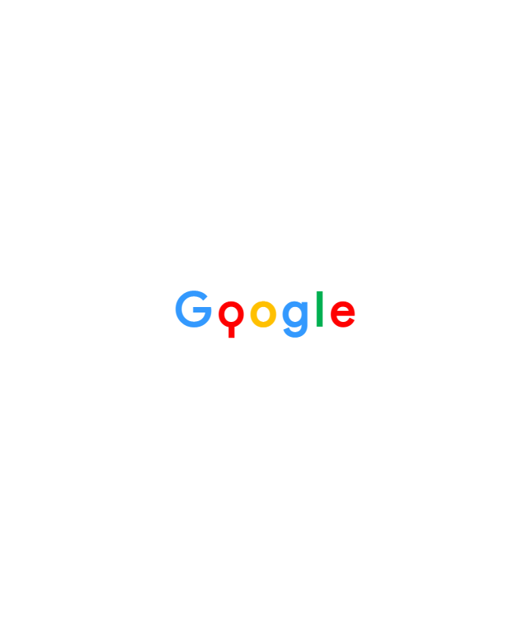
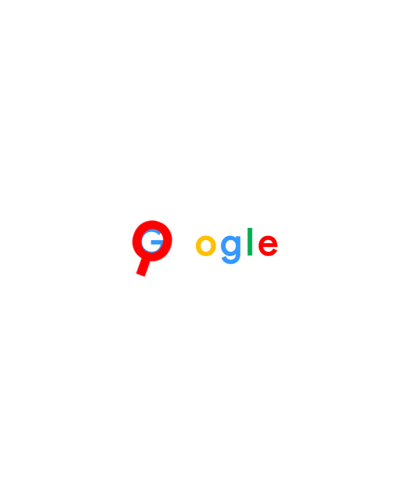

# Procesverslag
**Auteur:** Rosella Moens

**De opdrachten:** [opdracht 1](opdracht1/index.html) en [opdracht 2](opdracht2/index.html)

<!-- Markdown is een simpele manier om HTML te schrijven.  
Markdown cheat cheet: [Hulp bij het schrijven van Markdown](https://github.com/adam-p/markdown-here/wiki/Markdown-Cheatsheet).

Nb. De standaardstructuur en de spartaanse opmaak van de README.md zijn helemaal prima. Het gaat om de inhoud van je procesverslag. Besteedt de tijd voor pracht en praal aan je website.

Nb. Door *open* toe te voegen aan een *details* element kun je deze standaard open zetten. Fijn om dat steeds voor de relevante stuk(ken) te doen.
 -->

## Bronnenlijst
  1. CSS Animations properties (w3schools) https://www.w3schools.com/css/css3_animations.asp
  2. Include TTF font file in CSS (StackOverflow) https://stackoverflow.com/questions/24990554/how-to-include-a-font-ttf-using-css
  3. CSS z-index positions & rules (w3schools) https://www.w3schools.com/cssref/pr_pos_z-index.asp
  4. CSS ::before & ::after pseudoelements: how they work (YouTube: Kevin Powell) https://www.youtube.com/watch?v=zGiirUiWslI&ab_channel=KevinPowell
  5. CSS default styling of html elements (w3schools) https://www.w3schools.com/cssref/css_default_values.asp
  6. CSS transform property on span (StackOverflow) https://stackoverflow.com/questions/24961795/how-can-i-use-css3-transform-on-a-span
  7. Consecutive CSS animations (StackOverflow) https://stackoverflow.com/questions/48119227/chain-sequence-animation-in-css
  8. Consecutive CSS animations (CSS tricks) https://css-tricks.com/using-multi-step-animations-transitions/
  9. CSS animation keep final state, forwards (StackOverflow) https://stackoverflow.com/questions/12991164/maintaining-the-final-state-at-end-of-a-css3-animation
  10. CSS transform scale xy values (Mozilla) https://developer.mozilla.org/en-US/docs/Web/CSS/transform-function/scale()
  11. CSS jumping box animation (Prototypr) https://blog.prototypr.io/making-a-jumping-box-animation-using-only-css-9b6f1635b886
  12. CSS animation timing functions: cubic bezier (Cubic Bezier) https://cubic-bezier.com/#
  13. CSS transform-origin property (Mozilla) https://developer.mozilla.org/en-US/docs/Web/CSS/transform-origin
  14. CSS text-shadow and text-stroke for font borders (DelftStack) https://www.delftstack.com/howto/css/css-font-border/#use-the-text-shadow-property-to-apply-borders-to-font-in-css
  15. CSS span transform (StackOverflow) https://stackoverflow.com/questions/24961795/how-can-i-use-css3-transform-on-a-span

## Opdracht 1 plan

  
uitwerken na schetsen idee (voor week 2)

  ### Je storyboard:
    #### Lego 
      
   #### Google (later bijgemaakt)
      

  ### Je ambitie: 
  Aan deze technieken/punten wil ik werken:
  - Skill in CSS animation verbeteren
  - Met behulp van CSS animatie blokken 'realistische' zwaartekracht geven
  - Vormen maken met alleen html/css
  - CSS file duidelijker (mbv een volgorde binnen de properties) indelen
  - Root gebruiken voor meer dan kleuren
 

## Opdracht 1 reflectie

  
uitwerken bij afronden opdracht (voor week 3)

  ### Je uitkomst - karakteristiek screenshot(s):
  
  
  
  #### Lego
  
  
  
  
  
  #### Google
  
  
  
  
  

  ### Dit ging goed/Heb ik geleerd: 
  Korte omschrijving met plaatje(s)
    - Vormen maken met ::before & ::after pseudoelements. Ik heb hiermee de dots bovenop de legoblokjes gemaakt en het handvat van de magnifier. Ik heb before & after voorheen niet goed begrepen, nu ik ermee heb gewerkt is het makkelijker en ook zeer bruikbaar.
  - Ik ben erg blij met de animaties die ik heb gemaakt voor beide merken. De lego animatie is het langst en heeft de meeste keyframes en details. Hij flowt goed en het ritme past goed bij het concept van 'bouwen' met Lego blocks. Het heeft een vrolijke sfeer en kleuren. Ik heb geleerd over verschillende transform properties en hier ook veel aan getweaked.
  
  - De animatie voor Google is eenvoudiger, maar dit past ook bij het merk. Het is strak, maar wel speels. 
  - Ik heb in het design rekening gehouden met een dark mode en ook prefers reduced motion, beide opties werken! 
  
  - Toepassingen voor responsive design zijn minimaal maar effectief. Animaties werken goed op elk formaat.

 

  ### Dit was lastig/Is niet gelukt:
  Korte omschrijving met plaatje(s)
    - Ik wilde twee animaties maken voor Lego met dezelfde H1 met behulp van een 'button' waar je overheen kon hoveren. Ik heb het met een ul/li samenstelling geprobeerd en ook
met een before en after. Het probleem bij de eerste optie was dat de animatie niet afspeelt omdat de ul niet in de h1 zat, ik had geprobeerd deze in de h1 te plaatsen maar hierdoor roteerde de buttons mee. Hetzelfde gebeurde ook bij de before: omdat deze in de h1 stond, draaide hij mee.
    
    - Voor de Google animatie wilde ik dat de before pas zichtbaar zou worden wanneer de animatie plaatsvond. Ik had de before een opacity van 0 gegeven en deze aangeschakeld met behulp van een CSS animatie. De before vorm bleef echter constant ontzichtbaar. 
    
  - Ik heb de root enkel gebruikt voor kleuren, ik vond andere properties waarmee ik werkte niet logisch voor in de root.

## Opdracht 2 plan

  
uitwerken na schetsen idee (voor week 4)

  ### Je ontwerp:
  

  ### Je ambitie: 
  Aan deze technieken/punten wil ik werken:
  - punt 1
  - punt 2
  - nog een punt
  - ...

## Opdracht 2 test

  
uitwerken na testen (week 6/7)

  Neem minimaal 5 bevindingen op:

  ### Bevinding 1:
  Omschrijving van wat er nog niet orde was (tekst en afbeeding(en)).

  #### oplossing:
  Beschrijving hoe je het hebt hebt opgelost of als het niet gelukt is hoe je het zou oplossen (tekst en afbeeding(en)).

  ### Bevinding 2:
  Omschrijving van wat er nog niet orde was (tekst en afbeeding(en)).

  #### oplossing:
  Beschrijving hoe je het hebt hebt opgelost of als het niet gelukt is hoe je het zou oplossen (tekst en afbeeding(en)).

  ### Bevinding 3:
  ...

## Opdracht 2 reflectie

  
uitwerken bij afronden opdracht (voor week 8)

  ### Je uitkomst - karakteristiek screenshot(s):
  

  ### Dit ging goed/Heb ik geleerd: 
  Korte omschrijving met plaatje(s)

  

  ### Dit was lastig/Is niet gelukt:
  Korte omschrijving met plaatje(s)

  

